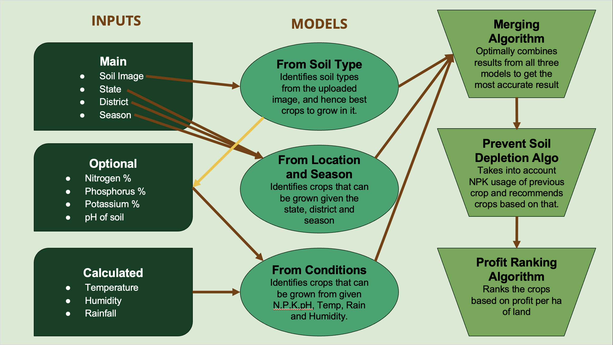
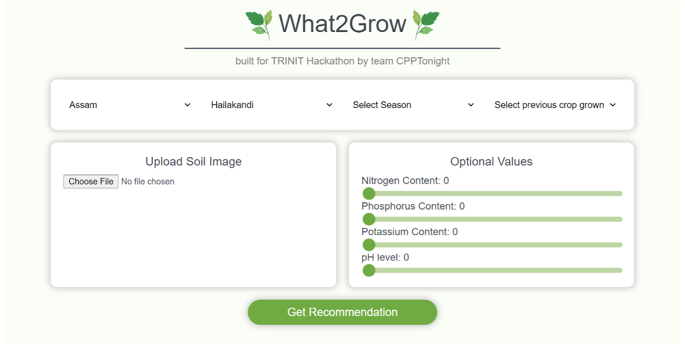
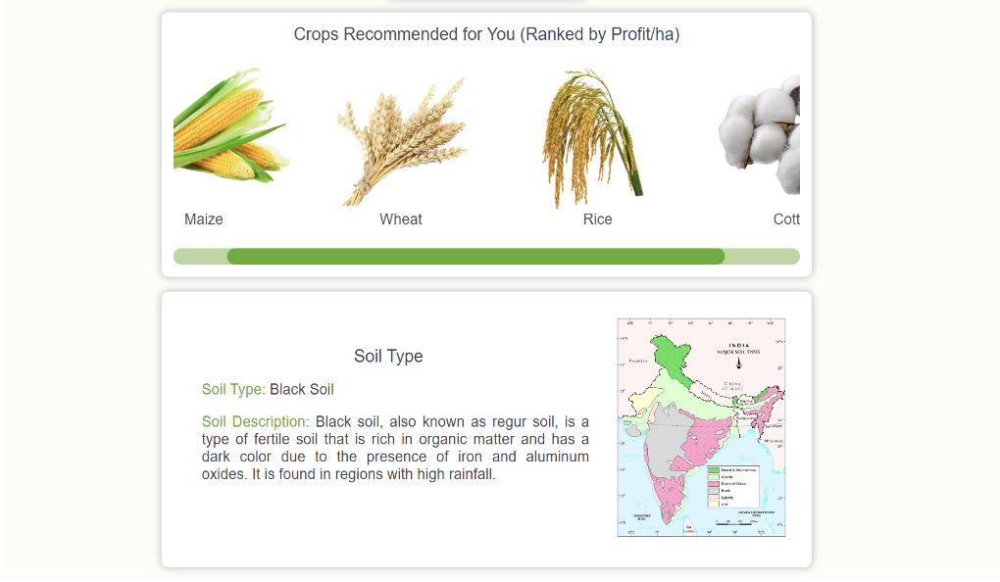

<H1 align="center">What2Grow</H1>
<H3 align="center">Crop Recommendation Using Machine Learning</H3>

## ABOUT
Uses ML and Deep Learning models for crop recommendation using soil images, geo-location, soil nutrition, weather and previous crops planted and ranked them by profit. 
Also built a front-end website to interact with the model.

### RESULTS

#### System Architecture 

#### FrontEnd

